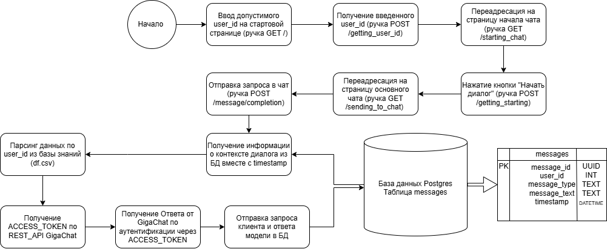
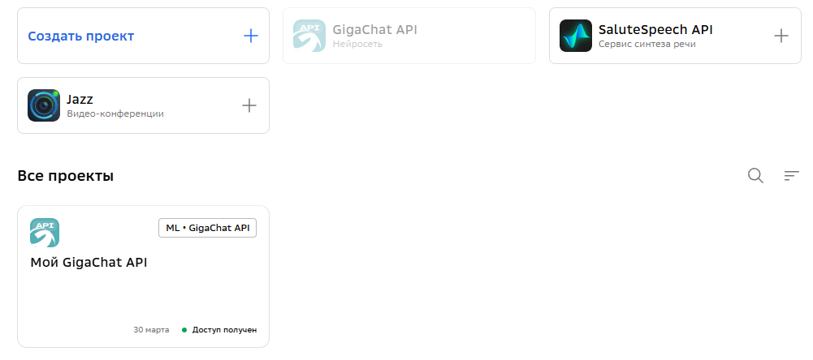
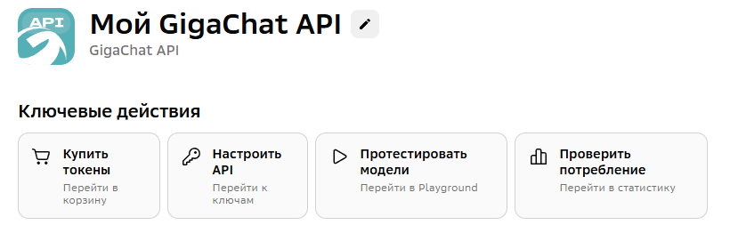
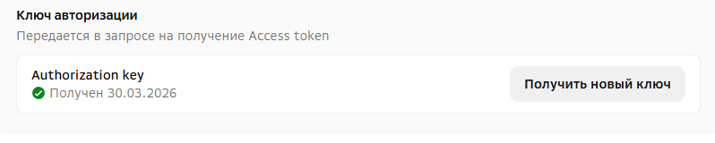

## test-task
# Краткое описание
Проект является текстовым ассистентом клиента компании "Финам", который предлагает ему 
образовательные курсы, учитывая степень интереса клиента к ним на основе рекомендательной системы.

# Технологический стэк
Frontend = HTML5 + CSS3 + JS
Backend = Python Fast API + БД Postgres
Devops = Возможность локального запуска через Docker (Dockerfile, docker-compose.yml)
AI = LLM (GigaChat Lite) для общения с пользователем и персональных рекомендаций по запросу,
pandas для обработки табличных данных и пополнения списком персональных курсов для клиента 
в системном промпте.

# Обоснование принятых технических решений
1. Бэкэнд
Fast API был выбран как фреймворк для бэкенда. В отличие от не менее популярных Django и Flask, он поддерживает асинхронный формат передачи данных, что может быть критически важно для скорости и качества ответов при теоретическом масштабировании данного проекта для продовой версии.
Postgres выбрана как одна из самых популярных СУБД для хранения чатов, ее функционала достаточно для хранения истории диалога, а библиотека sqlalchemy с ORM позволяет быстро связать ООП язык с реляционной БД.
Использование uuid в таблице messages (схема ниже) обусловлено удобным способом задать уникальный номер реплики, timestamp используется для добавения контекста в системный промпт LLM, учитывая временной порядок 
2. Фронтенд
Была использована форма range для определения user_id на стартовой странице, так как она исключает ошибки отсутствия ввода данных, ввода данных в неверном диапазоне user_id и ввод других данных (например: текста в свободной форме). К тому же она визуально понятна с точки зрения UX для новых пользователей, в отличие от поля со свободным вводом текста
Сине-белая стилистика выбрана по аналогии с крупными соцсетями и мессенджерами, плюс она более адаптивна для людей с дальтонизмом.
3. AI
В качестве AI-метода была выбрана **LLM**, так как с помощью нее возможно осуществлять 
персонализированный диалог по курсам, обрабатывать различные сценарные кейсы согласно ТЗ,
поддерживать гибкость обработки возражений. 
LLM выбрана в том числе и для поиска оптимальных с точки зрения вероятности интереса клиента курсов.
Была осуществлена предобработка с помощью pandas для извлечения только курсов, относящихся к клиенту по его user_id, а также их сортировка и приведение в читаемую строку без колоночной ориентации.
Данная предобработка необходима как для экономии токенов LLM (в отличие от использования всей таблицы в
системном промпте), так и для увеличения вероятности точности ответов LLM с помощью извлечения и форматирования нужного текста. 
Для поиска и ранжирования релевантных курсов (по вероятности интереса или другим критериям из ТЗ) также использовалась LLM, было эмпирически определено, что на предоставленном объеме данных данный функционал применим.

В качестве LLM была выбрана модель **Giga Chat Lite** (Giga Chat в вызове REST API). Данный выбор обусловлен особенностями тестового задания (необходимостью локального развертывания проекта через docker для проверки функционала с токеном LLM, GigaChat предоставляет больше всего токенов среди облачных отечественных провайдеров для бесплатных аккаунтов физических лиц). Для прода необходим более подробный технический сравнительно-сопоставительный анализ LLM, находящихся в контуре компании, для определения наиболее эффективной с точки зрения точности ответов модели и выполнения инструкции согласно ТЗ.

**Базовый системный промпт** для GigaChat представлен ниже:
```
Тебя зовут Виктор, ты методист в финансовой компании.

Твоя задача рекомендовать курсы для пользователя, исходя из каталога ниже.
Подбирай оптимальные курсы, учитывая вероятность интереса клиента к курсу, цену и скидку на курс.

Если клиент не задает вопросы о цене курсов, скидке, сложности и т.д.,
а интересуется курсами в общем, то учитывай только вероятность интереса клиента к курсу.
Всегда предоставляй в ответе курсы клиенту в порядке убывания вероятности интереса клиента к ним,
от курса с большей вероятностью интереса к курсу с меньшей вероятностью интереса.

Не называй клиента по его уникальному номеру, используй для обращения
уважительное обезличенное высказывание (например: уважаемый клиент). 
Обращайся к клиенту уважительно, всегда на вы, будь вежливым и тактичным.

Учитывай контекст для построения диалога и рекомендации курсов.
```

Также к промпту добавляются курсы из каталога под **user_id** клиента, контекст диалога (последние 10 сообщений клиента и модели вместе с датой и временем, параметр может быть отрегулирован в дальнейшем), и собственно **user_id**. 

Гиперпараметры модели:
1. Был выставлен top-p=0.0 (допустимый диапазон 0.0<=top_p<=1.0), для выбора наиболее релевантных токенов из наименьшего допустимого диапазона (для большего следования инструкциям)
2. Остальные гиперпараметры были взяли по умолчанию

# Структура проекта
```
project/
├── app/ # основной код проекта            
│   ├── backend # микросервер + БД    
       ├── __init__.py
       ├── database.py # Инициализация Postgres
       ├── main.py # Основные ручки микросервера
       ├── models.py # ORM модели для Postgres
    └── frontend # Фронтэнд сайта
        ├── css_templates # Шаблоны CSS стилей
            ├── style_start_template.css # Общий css-стиль для чат-бота
        ├── html_templates # Шаблоны HTML форм
            ├── chat_template.html # Шаблон основного чата
            ├── start_chat_template.html # Шаблон стартовой страницы диалог с ботом
            ├── start_template.html # Шаблон стартовой страницы ввода user_id
    └── llm
        ├── __init__.py
        ├── df.csv # База знаний по курсам
        ├── llm_api.py # Парсинг базы знаний и подключения GigaChat по REST API
        ├── prompt.py # Базовый системный промпт
    ├──__init__.py
└── images # Папка с изображениями для README.md
└── .env # Файл с переменными среды для запуска проекта
└── .env.example # Файл с названиями переменных среды для запуска проекта
└── .gitignore # Файл с названиями файлов, которые не должны публиковаться в репозиторий
└── docker-compose.yml # Файл для создания docker образа и контейнеров
└── Dockerfile # Конфигурационный docker файл
└── README.md  # Документация по проекту
└── requirements.txt # Список фреймворков и библиотек для запуска проекта
└── task.txt # Тестовое задание
└── wait_db.sh # Файл с системными требованиями по таймаутам для запуска Postgres
```
# Схема проекта

Кроме того, в микросервере кроме указанных выше ручек для ведения диалога, реализованы две статистические ручки, позволяющие получить все содержимое БД (ручка GET table/allcontent) и персонализированный диалог (POST table/usercontent) по user_id.

# Локальное развертывание через Docker
Учитывается, что на устройстве установлен docker и docker-compose.
Проверка:
`docker --version`
`docker-compose --version`
Если нет, то необходимо установить.
Для локального развертывания проекта через docker необходимо подготовить *.env файл со следующими переменными (примеры названия переменных есть в [файле](.env.example)):
1. **GIGACHAT_AUTHORIZATION_ID** (Ключ авторизации для доступа к облачной модели GigaChat, для дальнейшего выполнения ручек получения ACCESS_TOKEN и ответа от модели).
Сначала необходимо пройти регистрацию/авторизацию в личном кабинете GigaChat на [сайте](https://developers.sber.ru/studio/), после необходимо перейти в проект Мой GigaChat API:

Затем необходимо перейти в раздел Настроить API

Далее получить Authorization_key в разделе Ключ авторизации. 

Полученный ключ и есть **GIGACHAT_AUTHORIZATION_ID**
2. Необходимо заполнить логин, пароль, название базы и url для подключения к postgres:
**POSTGRES_USER** - логин для базы данных (например: "ivanovivan")
**POSTGRES_PASSWORD** - пароль для базы данных (например: "1743955UIOP")
**POSTGRES_DB** - название базы данных (например: chatbotbase)
**DATABASE_URL** - строка вида "postgresql://POSTGRES_USER:POSTGRES_PASSWORD@db:5432/POSTGRES_DB", где вместо **POSTGRES_USER** - логин базы, **POSTGRES_PASSWORD** - пароль базы, **POSTGRES_DB** - название базы

Далее выполняются следующие команды:
1. Клонирование репозитория (или через поиск ссылки github в IDE):
`git clone https://github.com/Arseniy-Polyakov/test-task`
`cd <имя проекта>`
2. Сборка образа проекта, создание контейнеров и их запуск:
`docker-compose up --build`
3. Сайт с текстовым ассистентом будет доступен по [ссылке](http://127.0.0.1:8000/)
4. Документация по проекту доступна по [ссылке](http://127.0.0.1:8000/docs)